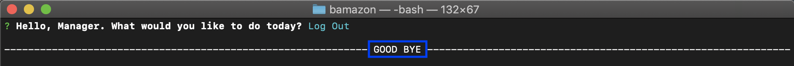

# Bamazon

## Overview
BAMAZON is an Amazon-like storefront based on MySQL. The app will take in orders from customers and deplete stocks from the store's inventory. Also, it is possible to track product sales across your store's departments and then provide a summary of the highest-grossing departments in the store.

## Technologies Used
- Node.js
- Javascript
- Inquirer
- NPM Package
- MySQL

## Interfaces
- Customer Interface
- Manager Interface
- Supervisor interface

## What Each Interface Does
**1. Customer Interface: node bamazonCustomer.js**

  The customer interface allows the user to view the current inventory of products with,
- Item IDs
- Product Names
- Department Names
- Prices
- Current Stock Levels 

Then, the user is able to purchase one of those listed products by inputting its Item ID and desired quantity. The order gets fulfilled by displaying the product's total price and updated stock level, if there is enough stock. But if there is not enough stock, the order do not get fulfilled, and shows a message to modify the user's order.

**2. Manager Interface: node bamazonManager.js**

  The manager interface allow to list a set of menu options:
- View Products for Sale
  * If a manager selects `View Products for Sale`, the app should list every available item: the item IDs, names, prices, and quantities.
  
- View Low Inventory
  * If a manager selects `View Low Inventory`, then it should list all items with an inventory count lower than five.

- Add to Inventory
  * If a manager selects `Add to Inventory`, your app should display a prompt that will let the manager "add more" of any item currently in the store.

- Add New Product
  * If a manager selects `Add New Product`, it should allow the manager to add a completely new product to the store.
  

**3. Supervisor Interface: node bamazonSupervisor.js**

  The supervisor interface allow to simulate basic profit and sales insights for the upper management. The manager interface allow to list a set of menu options:
  
- View Product Sales by Department
  * When a supervisor selects `View Product Sales by Department`, the app should display a summarized table in their terminal/bash window. Use the table below as a guide.
  

    | department_id | department_name | over_head_costs | product_sales | total_profit |
    | ------------- | --------------- | --------------- | ------------- | ------------ |
    | 01            | Electronics     | 10000           | 20000         | 10000        |
    | 02            | Clothing        | 60000           | 100000        | 40000        |

- Create New Department

## Demonstration Video
1) bamazonCustomer.js : https://youtu.be/ymjpHojze4M
2) bamazonManager.js : https://youtu.be/-Lc4MH6gyhM

## Screenshots of App

### Customer 01_Initial Values of Existing Products in Database

### Customer 02_Purchase Prompt & Validation for Item ID

### Customer 03_Purchase Prompt & Validation for Item Quantity

### Customer 04_Order Summary / Total Price / Updated Quantity

### Customer 05_Updated Quantity in Database after order is placed

### Customer 06_Messages when there is not enough stock

### Manager 01_Initial Values of Existing Products in Database

### Manager 02_View Products for Sale - Prompt

### Manager 03_View Products for Sale

### Manager 04_View Low Inventory - Prompt

### Manager 05_View Low Inventory (Qty < 5)

### Manager 06_Add to Inventory - Prompt

### Manager 07_Add to Inventory - Validation for Item ID

### Manager 08_Add to Inventory - Validation for Item Quantity

### Manager 09_Add to Inventory - Updated Inventory

### Manager 10_Add a New Product - Prompt

### Manager 11_Add a New Product - Updated Products List

### Manager 12_Add a New Product - Updated Database

### Manager 13_Log Out - Prompt

### Manager 14_Log Out

